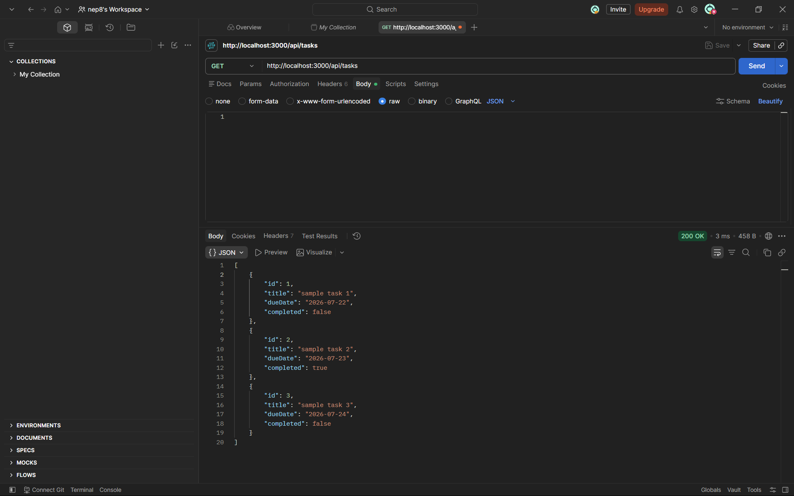
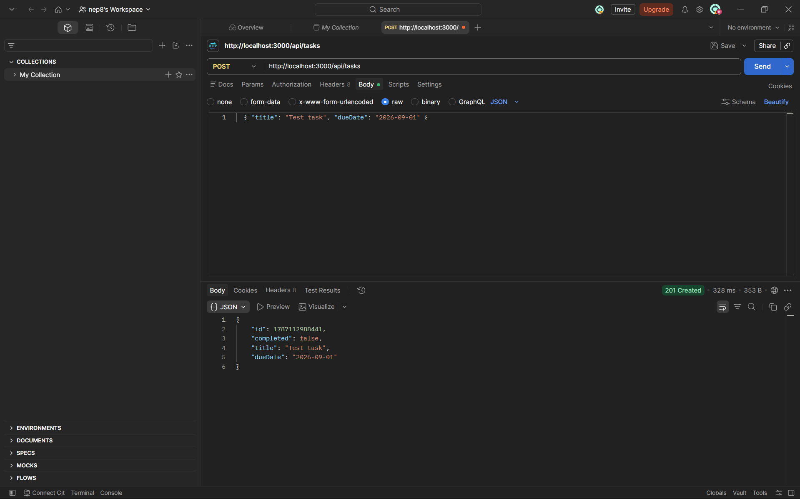
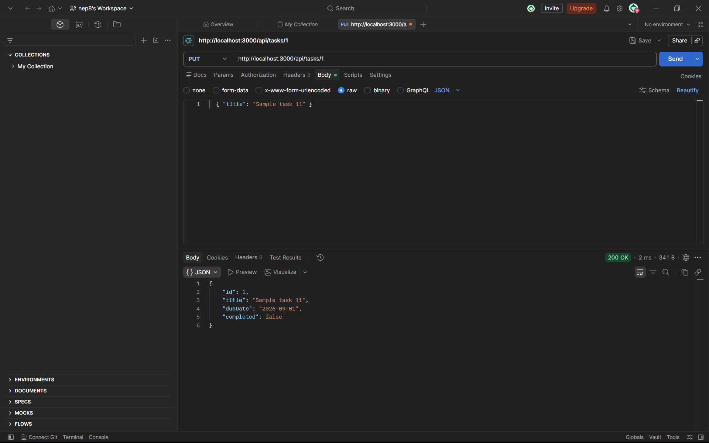
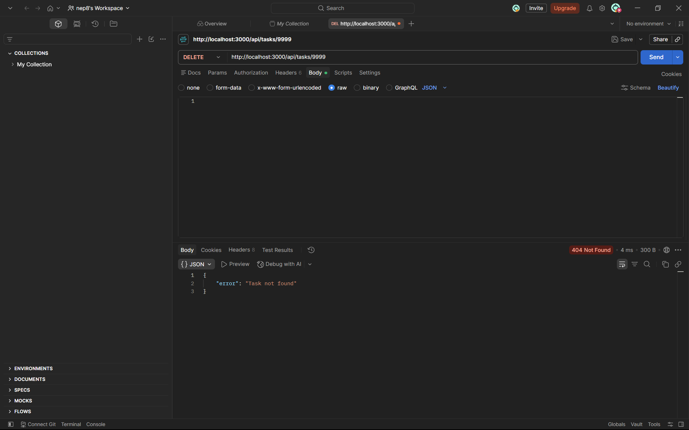

# itelect2-project
My IT Elective 2 backend web development project.

## API Testing

Screenshots of each endpoint test in postman

### GET /api/tasks

### POST /api/tasks

### PUT /api/tasks/:id

### DELETE /api/tasks/:id
